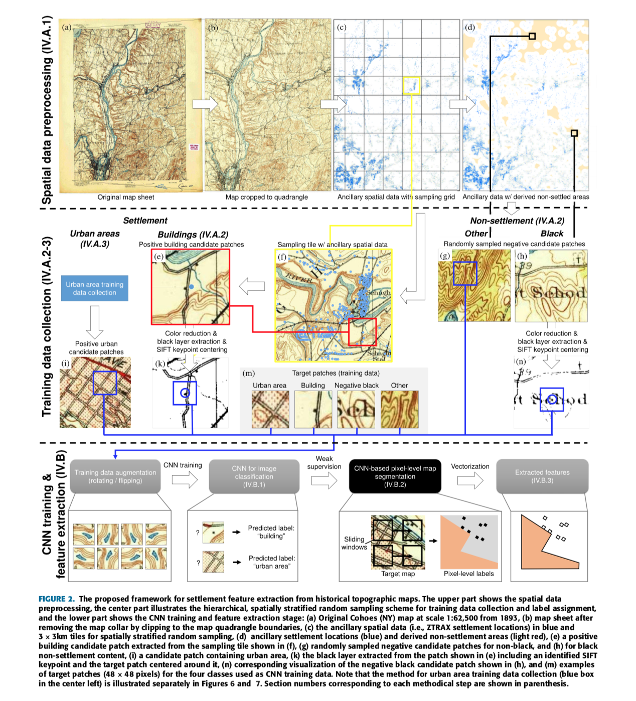
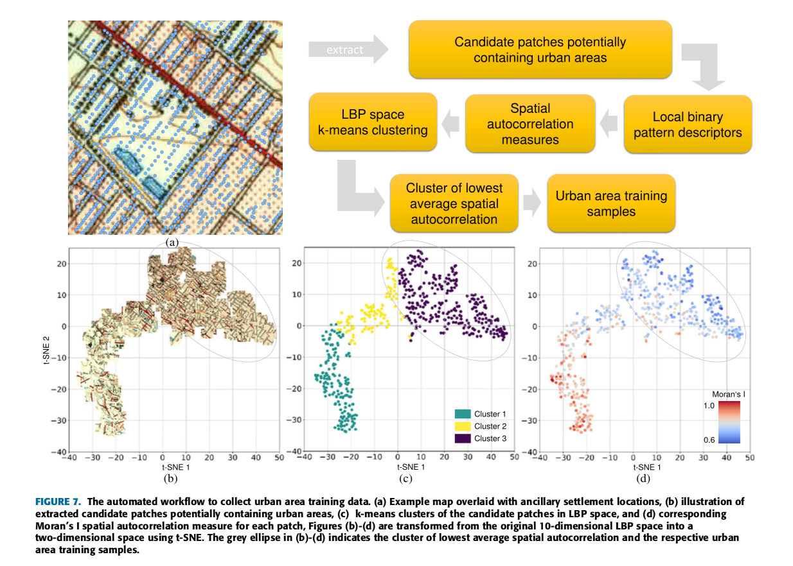
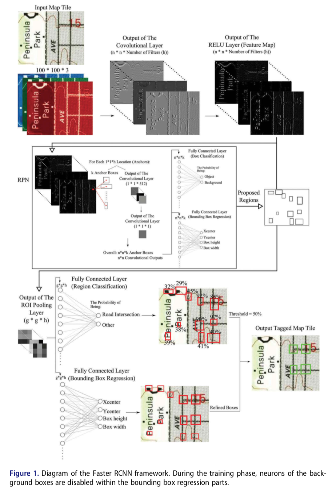
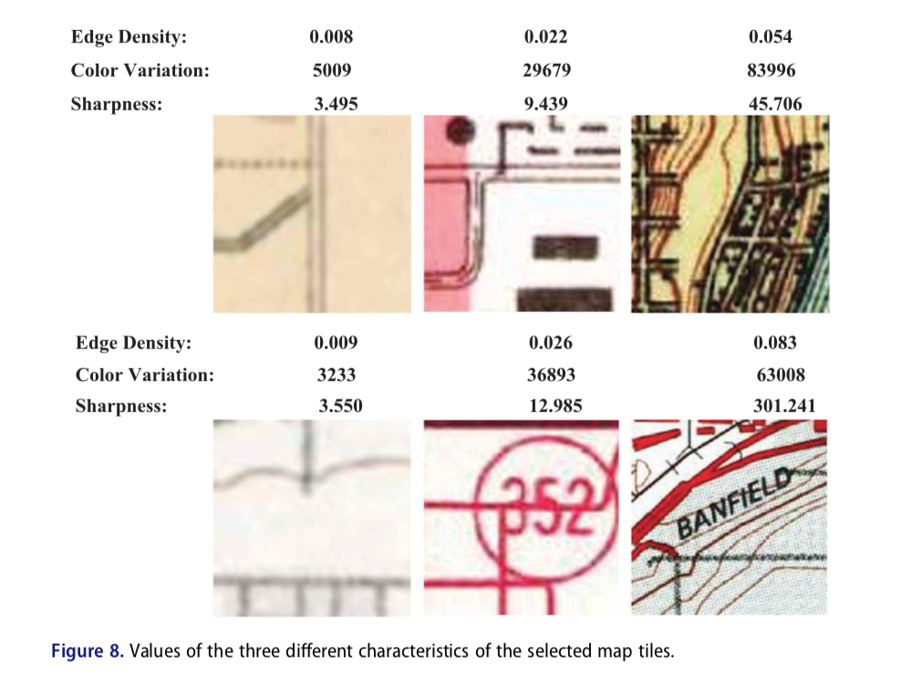
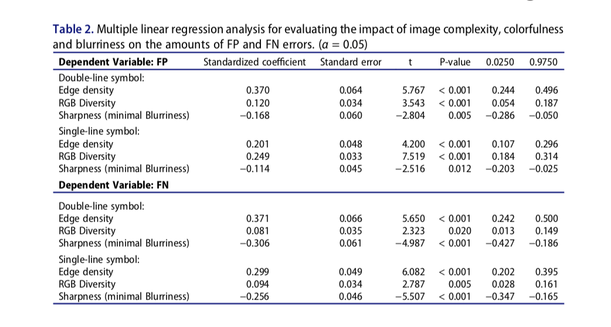
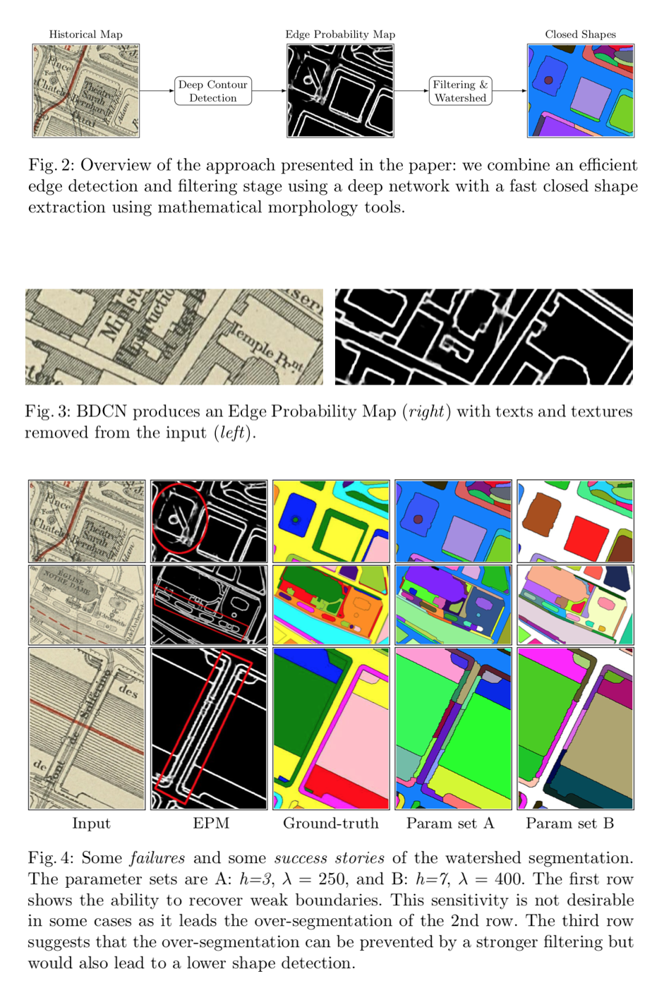
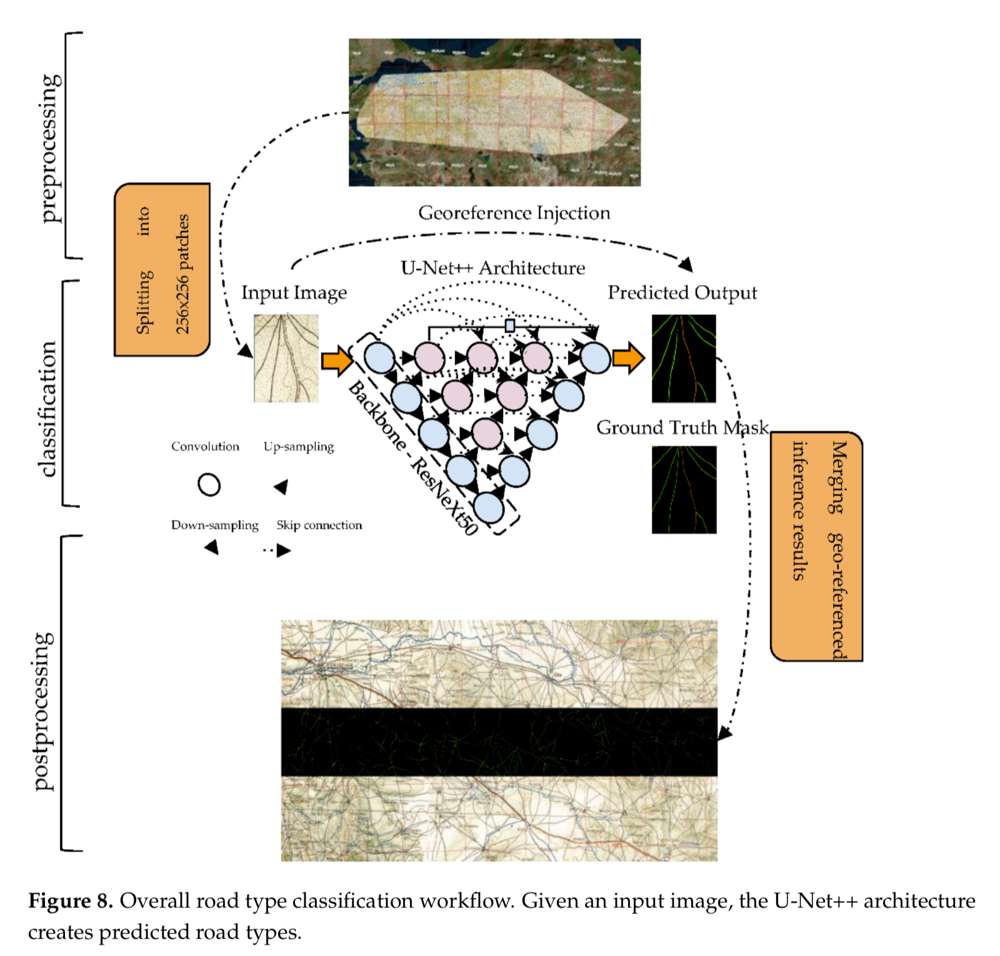

# A Grammar of Map Data Mining

References: 

[★ Automated Extraction of Human Settlement Patterns From Historical Topographic Map Series Using Weakly Supervised Convolutional Neural Networks](https://www.semanticscholar.org/paper/Automated-Extraction-of-Human-Settlement-Patterns-Uhl-Leyk/7f86369344f3cbc6d054b7df0e4fd9ba2882d29e)

[★ Automatic extraction of road intersection points from USGS historical map series using deep convolutional neural networks](https://www.semanticscholar.org/paper/Automatic-extraction-of-road-intersection-points-Saeedimoghaddam-Stepinski/1d9383a7773e488fc52ddb9362d2dffa9de3b2a2) -  [[**Data and Code**]](https://figshare.com/articles/dataset/Automatic_extraction_of_road_intersection_points_from_USGS_historical_map_series_using_deep_convolutional_neural_networks/10282085/1)

[★ Combining Deep Learning and Mathematical Morphology for Historical Map Segmentation](https://arxiv.org/abs/2101.02144) 

[★ Generic Semantic Segmentation of Historical Maps](https://www.google.com/url?sa=t&rct=j&q=&esrc=s&source=web&cd=&cad=rja&uact=8&ved=2ahUKEwi-35zi-Zb0AhUQVt8KHd7GCRwQFnoECAIQAQ&url=http%3A%2F%2Fceur-ws.org%2FVol-2989%2Flong_paper27.pdf&usg=AOvVaw0_nV8Pw1IHmcvZJotCggyb) - [[**Data and Code**]](https://github.com/RPetitpierre/Generic_Semantic_Segmentation_of_Historical_Maps)

[Historical map polygon and feature extractor](https://www.semanticscholar.org/paper/Historical-map-polygon-and-feature-extractor-Arteaga/03890f300b2b0b35b7785a7c272cc1c913a23e5f) 

[Automatic Road Extraction from Historical Maps Using Deep Learning Techniques: A Regional Case Study of Turkey in a German World War II Map](https://www.google.com/url?sa=t&rct=j&q=&esrc=s&source=web&cd=&ved=2ahUKEwihuZXg-Jb0AhUBneAKHUrzAP0QFnoECAwQAQ&url=https%3A%2F%2Fwww.mdpi.com%2F2220-9964%2F10%2F8%2F492%2Fpdf&usg=AOvVaw2SEVAOGKdOmigedTeBw5pR)

[Automated Extraction of Human Settlement Patterns From Historical Topographic Map Series Using Weakly Supervised Convolutional Neural Networks](https://www.semanticscholar.org/paper/Automated-Extraction-of-Human-Settlement-Patterns-Uhl-Leyk/7f86369344f3cbc6d054b7df0e4fd9ba2882d29e)

[Automatic Extraction of Forests from Historical Maps Based on Unsupervised Classification in the CIELab Color Space](https://www.semanticscholar.org/paper/Automatic-Extraction-of-Forests-from-Historical-on-Herrault-Sheeren/f45f82e4ce79f0718bceef2fcf972b4ac1ec3ea0) 

---

https://dhistory.hypotheses.org/346 (in German)

https://github.com/MinesParis-MorphoMath (https://smil.cmm.minesparis.psl.eu/doc/p600.html)

https://gitlab.kiv.zcu.cz/balounj/21_icdar_mapseg_competition/-/tree/master/